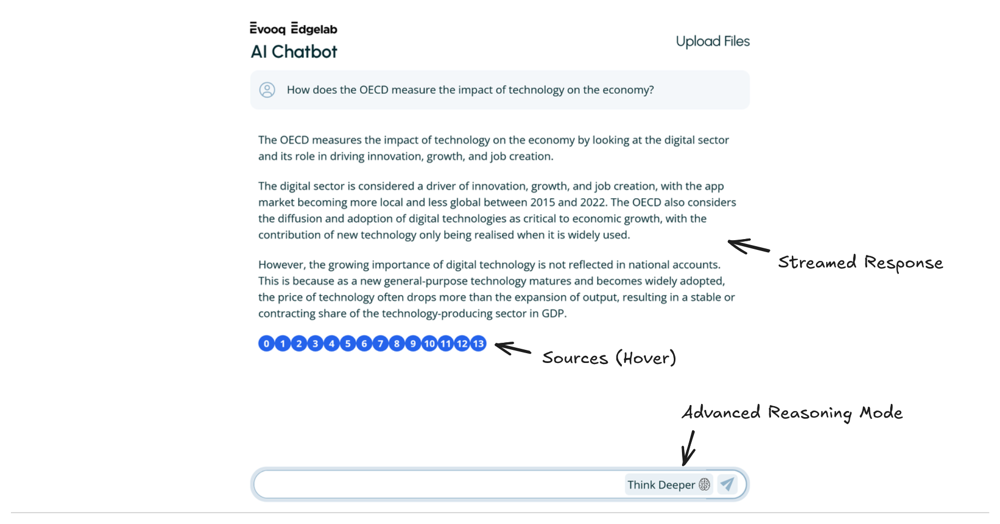
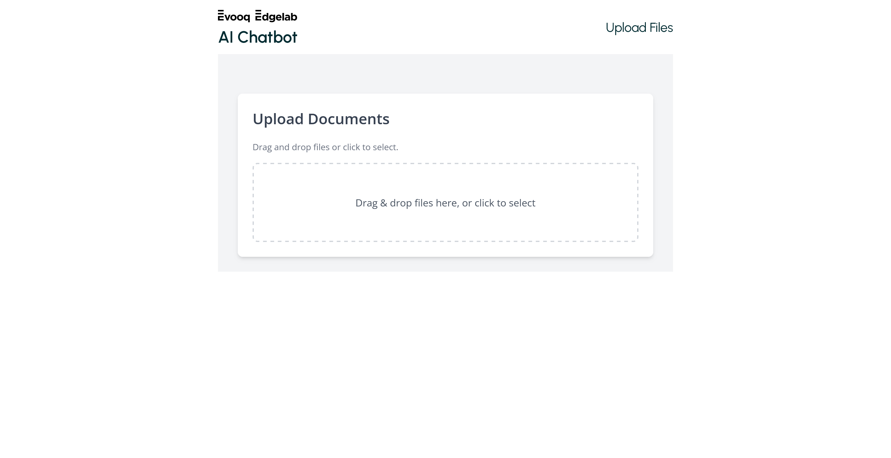
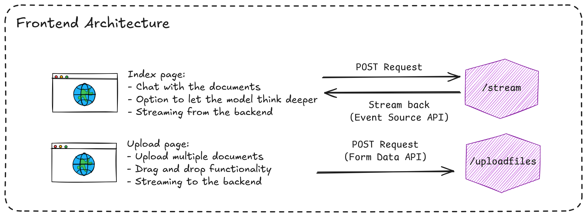
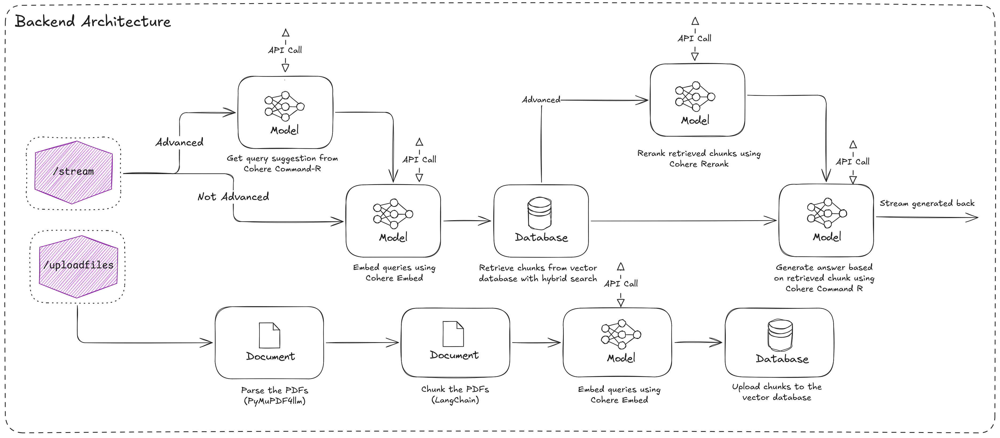

# FullStack RAG application
Made by: Jonathan Maillefaud

This project contains a FullStack RAG application. It allows users to upload documents and then ask questions which will be answered considering the context provided by the documents. Specifically, the application consists of 3 parts:
- A React frontend
- A FastAPI backend
- A Weaviate database

While the current state of the project is still quite simple, it was implemented in a robust manner, uses proven modern tools and allows for collaboration by multiple users.

## Installation

Clone the repository to use it:
```bash
git clone --recurse-submodules https://github.com/BrokenDuck/FullStack-RAG
```

## Usage

You should look at `./Frontend/README.md` for more information on how to get the frontend running. `./Backend/README.md` contains all the information for running the backend. You will need some keys for the Cohere model API. You can create a free account with some API credits [on the Cohere website](https://cohere.com/).

One you have both running, you can upload your PDFs and ask away. The application only supports PDFs for now, but can be changed to support a wide varietry of documents with minimal effort. Please note that parsing, chunking and embedding the vectors can take a significant amount of time. Also, monitor your API credits to avoid annoying surprises.

## Frontend


The chat page


The document upload page


The architecture of the frontend

The frontend is designed to be simple and usable. The code was written to be efficient and maintainable while providing a basis for a larger frontend application and for collaboration. Strong coding guidelines are available through ESLint and Prettier. Robust code checking is implemented using Typescript and Vitest.

## Backend


The architecture of the backend

The backend is focused on speed while maintaining a high level of accuracy.
- The backend uses the models offered by Cohere because they offer state-of-the-art performance for a reasonable cost. Additionally, they are specifically tailored for RAG applications such as this one.
- To make the backend API scalable, all endpoints are implemented using async python code and can thus handle a large number of concurrent queries. For more performance on the file upload, more parallelism should be used. In addition, to minimize the query-to-first-token latency, the response is streamed directly from the backend.
- The uploaded PDFs are parsed using PyMuPDF4LLM. They are converted to markdown, keeping tables and detecting headings. The markdown is then parsed based on the headings, this allows chunking the pdf thematically for higher accuracy. Lastly, if the chunks are still too large they are chunking with overlap to fit in the LLM context window.
- The backend supports a mode for higher chunk-retrieval accuracy at a higher api cost. This uses tool calling to the Cohere Command-R model and the specific Cohere ReRank model.
- Notice the model currently only supports English documents, but supporting other languages (including non-latin languages like Arabic, Chinese or Vietnamese) is a simple as changing the embedding model to be multilingual.

## Database

For the document chunk persistence, we use the [Weaviate](https://weaviate.io/) database. The database can be deployed using a Docker image or a Kubernetes helm for production. Weaviate offers advanced hybrid querying algorithm that allow to mix standard text search (BM25F) with large scale nearest neighbor search (HNSW).